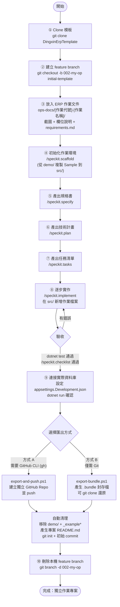

# 鼎新 ERP 作業轉換模板 (DingxinErpTemplate)

將鼎新 ERP 的各種作業快速轉換成 .NET 8 Web App 的標準模板專案。

> 📘 **第一次使用？** 請看 **[從零開始操作手冊](docs/getting-started.md)** — Phase 0 到 Phase 6 完整教學。

## 🏗️ 架構

採用 **Clean Architecture** 三層架構：

```
DingxinErpTemplate.sln         # 根目錄 .sln（預設指向 demo/src/，scaffold 後指向 src/）
demo/                          # ★ 完整 Sample 範例（唯讀參考，可獨立 build/run）
├── DingxinErpTemplate.sln    #   demo 專用 .sln
├── src/
│   ├── DingxinErp.Web/       #   範例表現層
│   ├── DingxinErp.Core/      #   範例核心層（SampleHeader/SampleDetail）
│   └── DingxinErp.Infrastructure/  # 範例資料層
└── tests/
src/                           # ★ 開發區（scaffold 前為空，scaffold 後為作業專案）
├── DingxinErp.Web/            #   表現層 (MVC Controllers + Views + API)
├── DingxinErp.Core/           #   核心業務層 (Entities, DTOs, Services, Validators)
└── DingxinErp.Infrastructure/ #   基礎設施層 (DbContext, Repositories)
tests/                         # 單元測試（scaffold 後才有內容）
ops-docs/
└── [作業代號]-[作業名稱]/       # 放置原始ERP畫面截圖與作業說明文件
```

**依賴方向:** Web → Core ← Infrastructure（Core 不依賴任何外部專案）

## 🚀 快速開始

```powershell
# 1. Clone
git clone https://github.com/chrisbln2014/DingxinErpTemplate.git
cd DingxinErpTemplate

# 2. 建置（根目錄 .sln 預設指向 demo 範例）
#    ★ 首次 build 會自動啟用 gitleaks pre-commit hook（防止誤提交密碼/金鑰）
#    需先安裝 gitleaks: winget install gitleaks
dotnet build

# 3. 執行 Demo 範例（不需設定資料庫，自動使用 InMemory DB + 種子資料）
dotnet run --project demo/src/DingxinErp.Web

# 4. 瀏覽 http://localhost:5000

# 5. (建議) 安裝 gitleaks pre-commit hook — 防止誤提交密碼/金鑰
#    需先安裝 gitleaks: winget install gitleaks
powershell -File .specify/scripts/powershell/install-security-hook.ps1
```

### 建立你的 ERP 作業

```powershell
# 1. 把 ERP 截圖/文件丟進 ops-docs/
# 2. 執行 scaffold（從 demo/ 複製 Sample 到 src/）
/speckit.scaffold

# 3. 執行 SDD 流程
/speckit.specify → /speckit.plan → /speckit.tasks → /speckit.implement → /speckit.checklist

# 4. 完成後執行
dotnet run --project src/DingxinErp.Web
```

| 方式 | 適合場景 | 詳細教學 |
|------|---------|----------|
| **A. Copilot CLI Skill** | 快速 scaffold，4 輪對話自動產生 | [操作手冊 Phase 4 方式 A](docs/getting-started.md#方式-acopilot-cli-skill推薦) |
| **B. SDD 流程 (spec-kit)** | 正式專案，需要規格文件和品質管控 | [操作手冊 Phase 4 方式 B](docs/getting-started.md#方式-bsdd-流程spec-kit) |

## �️ 完整開發流程（一條龍）



> 📘 每個步驟的詳細說明請見 [完整操作手冊](docs/getting-started.md)

## �📋 技術選型

| 項目 | 版本 | 說明 |
|------|------|------|
| .NET | 8.0 LTS | 長期支援至 2026/11 |
| EF Core | 8.0.x | ORM (取代 DbNetSuiteCore) |
| FluentValidation | 11.x | 輸入驗證 |
| Swagger | 6.x | API 文件 (開發環境) |
| Bootstrap | 5.3 (CDN) | 前端 CSS |
| jQuery | 3.7 (CDN) | AJAX + DOM |
| xUnit + Moq | latest | 單元測試 |

## 📐 核心設計模式

### CrudResult\<T\> — 統一回傳格式

```csharp
CrudResult<T>.SuccessResult(data, "操作成功");
CrudResult<T>.ErrorResult("找不到資料");
```

### IAuditableEntity — 審計欄位

```csharp
// 自動在 Service 層填寫 CREATOR/CREATE_DATE/MODIFIER/MODI_DATE/FLAG
entity.Creator = "SYSTEM";
entity.CreateDate = DateTime.Now.ToString("yyyyMMdd");
```

### char 欄位設定（鼎新 ERP 相容）

```csharp
// ★ 重要：鼎新 ERP 使用 char() 欄位，必須設定 IsFixedLength()
builder.Property(e => e.TA001)
    .HasMaxLength(4)
    .IsFixedLength()
    .IsUnicode(false);
```

## 🔗 API 端點

★ **單頭和單身 CRUD 完全分離**，各自獨立操作

```
# 單頭 CRUD（僅單頭欄位）
GET    /api/{entity}                              # 分頁查詢 + 搜尋
GET    /api/{entity}/{pk1}/{pk2}                  # 依主鍵取得單頭
POST   /api/{entity}                              # 新增單頭（不含單身）
PUT    /api/{entity}/{pk1}/{pk2}                  # 更新單頭（不含單身）
DELETE /api/{entity}/{pk1}/{pk2}                  # 刪除單頭（Cascade 刪除單身）

# 單身 CRUD（獨立逐筆操作）
GET    /api/{entity}/{pk1}/{pk2}/details          # 列出所有單身
GET    /api/{entity}/{pk1}/{pk2}/details/{seq}    # 取得單筆單身
POST   /api/{entity}/{pk1}/{pk2}/details          # 新增單筆單身
PUT    /api/{entity}/{pk1}/{pk2}/details/{seq}    # 更新單筆單身
DELETE /api/{entity}/{pk1}/{pk2}/details/{seq}    # 刪除單筆單身
```

## 🖥️ 前端 UI 架構

```
┌─────────────────────────────────────────────────────────┐
│ [搜尋列] 搜尋框 + 搜尋/清除按鈕 + 單頭 新增/編輯/刪除    │
├─────────────────────────────────────────────────────────┤
│ [單頭表格] checkbox + 欄位 + 狀態 Badge + 單身筆數       │
│ ├ 行1 ☐ 3301  20260001001  台北科技公司  Y  [3]         │
│ ├ 行2 ☐ ...                                            │
│ └ 分頁: « 1 2 3 » 共 N 筆                               │
├─────────────────────────────────────────────────────────┤
│ [單身區域] （點擊單頭行自動選取 + 顯示單身）                  │
│ ├ 標題 + [新增明細] [編輯明細] [刪除明細] ← 獨立 CRUD     │
│ ├ ☐ 0001  BOM-A001  主機板 A1  10  1,500  15,000       │
│ └ ☐ 0002  BOM-A002  記憶體 DDR5  20  800  16,000       │
└─────────────────────────────────────────────────────────┘

#headerModal       — 單頭新增/編輯（僅單頭欄位）
#detailModal       — 單身新增/編輯（單筆明細欄位，金額自動計算）
#deleteHeaderModal — 單頭刪除確認
#deleteDetailModal — 單身刪除確認
```

## 🔄 SDD 流程 (spec-kit)

本模板整合了 [GitHub Spec Kit](https://github.com/github/spec-kit) 的 SDD（Specification-Driven Development）流程。

### 團隊憲法（Constitution）

內建 6 大核心原則，所有 SDD 產出皆遵循：

| 原則 | 說明 |
|------|------|
| I. 模組化架構 | Clean Architecture 三層分離 |
| II. 文件優先 | 所有功能需有完整文件 |
| III. 設定驅動開發 | 行為由設定控制，非修改程式碼 |
| IV. 服務導向架構 | 單一職責、明確介面、CrudResult 統一回傳 |
| V. 使用者中心設計 | 傳統 Web Form 風格、Header-Detail 連動 |
| VI. 語言規範 | 文件用繁體中文、程式碼用英文 |

### 開發流程

```
/speckit.scaffold     → ★ Step 0：掃描 ops-docs/ → 詢問作業代號 → 從 demo/ 複製到 src/
/speckit.specify      → 產出規格書（自動分析 ops-docs 截圖和文件）
/speckit.plan         → 產出技術計畫
/speckit.tasks        → 產出任務清單
/speckit.implement    → 逐步實作（在 src/ 中新增作業檔案）
/speckit.checklist    → 驗收檢核
```

> 📘 完整教學請見 [操作手冊 Phase 4 方式 B](docs/getting-started.md#方式-bsdd-流程spec-kit)

## 📁 範例檔案對照表
> 範例檔案位於 `demo/src/` 中，scaffold 後會複製到 `src/`，SDD 實作時自動替換為作業對應檔案。
| 模板檔案 | 用途 | 實際專案改名範例 |
|----------|------|-----------------|
| `SampleHeader.cs` | 單頭 Entity | `Purta.cs` |
| `SampleDetail.cs` | 單身 Entity | `Purtb.cs` |
| `SampleHeaderDto.cs` | 單頭 DTO | `PurtaDto.cs` |
| `SampleDetailDto.cs` | 單身 DTO | `PurtbDto.cs` |
| `CreateSampleHeaderRequest.cs` | 單頭新增 DTO | `CreatePurtaRequest.cs` |
| `UpdateSampleHeaderRequest.cs` | 單頭更新 DTO | `UpdatePurtaRequest.cs` |
| `MappingExtensions.cs` | Entity↔DTO 映射 | 依作業改名 |
| `SampleService.cs` | 業務邏輯 | `PurchaseOrderService.cs` |
| `SampleRepository.cs` | 資料存取 | `PurchaseOrderRepository.cs` |
| `SampleController.cs` | API 端點 | `PurchaseOrderController.cs` |
| `Views/Sample/Index.cshtml` | CRUD 頁面 | `Views/PurchaseOrder/Index.cshtml` |
| `crud-common.js` | 單頭 CRUD 通用 JS | 通常不需改名 |
| `master-detail.js` | 單身連動 + 單身 CRUD | 通常不需改名 |

## ⌨️ 鍵盤快捷鍵

| 快捷鍵 | 功能 |
|--------|------|
| `Ctrl+N` | 新增單頭 |
| `Ctrl+E` | 編輯單頭 |
| `Delete` | 刪除選取項 |
| `F5` | 重新整理 |
| `Escape` | 關閉 Modal |

## 🖱️ 互動行為

| 操作 | 行為 |
|------|------|
| 點擊單頭行 | 自動選取該行 (checkbox 勾選 + 啟用編輯/刪除) + 載入單身明細 |
| 切換單頭行 | 前一行自動取消選取（單選模式） |
| 點擊單身行 | 自動切換該行 checkbox |
| 勾選多筆單頭 | 可批次刪除 |
| 勾選單筆單身 | 啟用編輯明細/刪除明細按鈕 |

## 📂 完整目錄結構

```
DingxinErpTemplate/
├── DingxinErpTemplate.sln            # 根目錄 .sln（預設→demo/src/，scaffold後→src/）
├── demo/                             # ★ 完整 Sample 範例（唯讀參考）
│   ├── DingxinErpTemplate.sln       #   demo 專用 .sln
│   ├── src/
│   │   ├── DingxinErp.Core/         #   範例核心層（SampleHeader/SampleDetail）
│   │   ├── DingxinErp.Infrastructure/ # 範例資料層
│   │   └── DingxinErp.Web/          #   範例表現層（含 Views、wwwroot）
│   └── tests/
├── src/                              # ★ 開發區（scaffold 前為空）
│   ├── DingxinErp.Core/             #   核心業務層
│   ├── DingxinErp.Infrastructure/   #   基礎設施層
│   └── DingxinErp.Web/              #   表現層
├── tests/                            # 單元測試（scaffold 後才有內容）
├── ops-docs/                         # ★ ERP 作業原始文件
│   ├── README.md                    #   說明如何使用此資料夾
│   └── [作業代號]-[作業名稱]/         #   每個作業一個資料夾
│       ├── screenshots/             #   ERP 畫面截圖
│       ├── documents/               #   說明文件 (PDF/Word/Excel)
│       └── requirements.md          #   客製化需求說明
├── specs/                            # SDD 規格文件產出
├── skill/                            # Copilot CLI Skill
├── .specify/                         # spec-kit SDD 設定 + 團隊憲法
├── .githooks/                        # ★ Git hooks（dotnet build 自動啟用）
│   └── pre-commit                   #   gitleaks 敏感資料偵測
├── .github/
│   ├── agents/                      #   speckit agent 定義檔
│   └── workflows/                   #   CI 流程
│       └── security-scan.yml        #   gitleaks PR/push 掃描
├── Directory.Build.props             # MSBuild — 自動設定 core.hooksPath
├── .gitleaks.toml                    # gitleaks 排除規則
├── CLAUDE.md / AGENTS.md / GEMINI.md # AI 協作指引
├── PROGRESS.md                       # 開發進度記錄
└── README.md                         # 本文件
```

## 🌿 分支說明

| 分支 | 用途 |
|------|------|
| `main` | 穩定版模板（建議使用） |
| `feature/openspec-superpowers-skills` | OpenSpec + Superpowers 實驗整合（開發中） |

## 📖 相關文件

- **[docs/getting-started.md](docs/getting-started.md)** — 📘 **從零開始操作手冊**（環境準備 → Demo → 建立作業 → 匯出）
- [docs/tutorial-new-operation.md](docs/tutorial-new-operation.md) — 手動 10 步驟建立作業（底層原理參考）
- [ops-docs/README.md](ops-docs/README.md) — 作業文件存放說明（截圖和文件如何放置）
- [CLAUDE.md](CLAUDE.md) — Claude AI 協作指引（Anthropic Claude / Copilot CLI）
- [AGENTS.md](AGENTS.md) — 跨工具 AI 指引（GitHub Copilot、OpenAI Codex、Cursor）
- [GEMINI.md](GEMINI.md) — Google Gemini AI 協作指引
- [PROGRESS.md](PROGRESS.md) — 開發進度記錄（已完成項目、架構決策、統計數據）
- [.specify/memory/constitution.md](.specify/memory/constitution.md) — 團隊開發憲法（英文版）
- [.specify/memory/constitution-zh-TW.md](.specify/memory/constitution-zh-TW.md) — 團隊開發憲法（繁體中文版）
