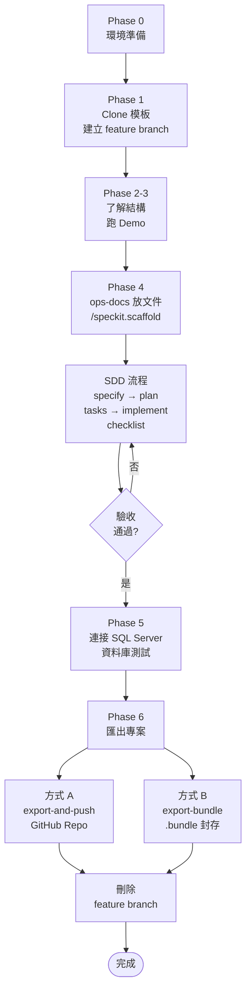

# 從零開始：使用模板建立 ERP 專案 — 完整操作手冊

> **目標讀者**：拿到這份模板、想建立自己的 ERP 作業 Web App 的開發者。
> **情境範例**：將鼎新 ERP「採購單建立」(PURTA/PURTB) 轉換為 .NET 8 Web App。

---

## 📖 目錄

- [Phase 0：環境準備](#phase-0環境準備)
- [Phase 1：取得模板](#phase-1取得模板)
- [Phase 2：了解模板結構](#phase-2了解模板結構)
- [Phase 3：先跑起來看 Demo](#phase-3先跑起來看-demo)
- [Phase 4：建立你的 ERP 作業（兩種方式）](#phase-4建立你的-erp-作業兩種方式)
  - [方式 A：Copilot CLI Skill（推薦）](#方式-acopilot-cli-skill推薦)
  - [方式 B：SDD 流程（spec-kit）](#方式-bsdd-流程spec-kit)
- [Phase 5：連接實際資料庫](#phase-5連接實際資料庫)
- [Phase 6：匯出為獨立專案](#phase-6匯出為獨立專案)
- [附錄 A：產出的檔案清單](#附錄-a產出的檔案清單)
- [附錄 B：常見問題](#附錄-b常見問題)
- [附錄 C：前端 JS 說明](#附錄-c前端-js-說明)
- [附錄 D：手動建立參考](#附錄-d手動建立參考)

---

## 一條龍流程總覽



| Phase | 說明 | 預計時間 |
|-------|------|---------|
| Phase 0 | 安裝 .NET 8、Git、選用工具 | 10 分鐘 |
| Phase 1 | Clone 模板、建立 feature branch | 5 分鐘 |
| Phase 2-3 | 了解結構、執行 Demo | 15 分鐘 |
| Phase 4 | 放入文件、scaffold、SDD 開發 | 1-2 小時 |
| Phase 5 | 連接實際資料庫 | 10 分鐘 |
| Phase 6 | 匯出為獨立專案 | 5 分鐘 |

---

## Phase 0：環境準備

### 必要工具

```powershell
# 確認版本
dotnet --version    # 需要 8.0+
git --version       # 需要 2.x+
```

如果沒有，請安裝：
- [.NET 8 SDK](https://dotnet.microsoft.com/download/dotnet/8) — 必須
- [Git](https://git-scm.com/) — 必須

### 選用工具

```powershell
gh --version        # GitHub CLI（匯出推送用）
node --version      # Node.js 18+（SDD 流程用）
```

### 資安工具（建議）

```powershell
# 安裝 gitleaks — 防止誤提交密碼/金鑰
winget install gitleaks
```

> 首次 `dotnet build` 時會自動啟用 pre-commit hook，不需手動設定。
> 若未安裝 gitleaks，commit 時會顯示警告但不阻擋。

### 開發工具

推薦使用 **Visual Studio 2022** 或 **VS Code + C# Dev Kit**。

---

## Phase 1：取得模板

### 方式 A：Clone（推薦）

```powershell
cd C:\projects
git clone https://github.com/chrisbln2014/DingxinErpTemplate.git
cd DingxinErpTemplate
```

### 方式 B：直接複製

```powershell
Copy-Item -Recurse C:\path\to\DingxinErpTemplate C:\projects\MyErpProject
cd C:\projects\MyErpProject
```

---

## Phase 2：了解模板結構

```
DingxinErpTemplate/
│
├── DingxinErpTemplate.sln              # 根目錄 .sln（預設指向 demo/src/）
│
├── demo/                               # ★ 完整 Sample 範例（唯讀參考，scaffold 複製來源）
│   ├── DingxinErpTemplate.sln         #   demo 專用 .sln
│   ├── src/
│   │   ├── DingxinErp.Core/           #   核心業務層（不依賴外部）
│   │   │   ├── Common/                #     CrudResult, PagedResult, IAuditableEntity
│   │   │   ├── Entities/              #     Entity 類別（對應 ERP 表格）
│   │   │   ├── DTOs/                  #     資料傳輸物件 + 映射
│   │   │   ├── Interfaces/            #     Repository / Service 介面
│   │   │   ├── Services/              #     業務邏輯實作
│   │   │   └── Validators/            #     FluentValidation 驗證器
│   │   │
│   │   ├── DingxinErp.Infrastructure/ # 資料存取層
│   │   │   ├── Configurations/        #     EF Core 欄位設定
│   │   │   ├── Data/                  #     AppDbContext
│   │   │   └── Repositories/          #     Repository 實作
│   │   │
│   │   └── DingxinErp.Web/            # 表現層
│   │       ├── Controllers/           #     API + MVC Controller
│   │       ├── Middleware/             #     全域例外處理
│   │       ├── Views/                 #     Razor 頁面
│   │       ├── wwwroot/               #     JS, CSS
│   │       ├── Program.cs             #   ★ 進入點（DI、中介軟體、種子資料）
│   │       └── appsettings.json       #     連線字串模板
│   └── tests/
│
├── src/                                # ★ 開發區（scaffold 前為空，scaffold 後為作業專案）
├── tests/                              # 單元測試（scaffold 後才有內容）
├── ops-docs/                           # ERP 作業原始文件（截圖/說明）
├── specs/                              # SDD 規格文件產出
├── docs/                               # 教學文件
├── CLAUDE.md / AGENTS.md / GEMINI.md   # AI 協作指引
├── PROGRESS.md                         # 開發進度
└── README.md                           # 使用說明
```

### 架構依賴方向

```
  Web (表現層)
    ↓ 引用
  Core (核心層) ← 不依賴任何專案
    ↑ 引用
  Infrastructure (資料層)
```

### 模板內建的共用元件（你不需要改）

> 以下元件位於 `demo/src/` 中，scaffold 後會自動複製到 `src/`。

| 元件 | 位置 | 用途 |
|------|------|------|
| `CrudResult<T>` | Core/Common/ | 統一 API 回傳格式 `{Success, Message, Data, Errors}` |
| `PagedResult<T>` | Core/Common/ | 分頁查詢結果 `{Items, TotalItems, TotalPages, ...}` |
| `IAuditableEntity` | Core/Common/ | 審計欄位介面 (CREATOR/CREATE_DATE/MODIFIER/MODI_DATE/FLAG) |
| `crud-common.js` | wwwroot/js/ | Toast 通知、分頁元件、搜尋、Modal、快捷鍵 |
| `master-detail.js` | wwwroot/js/ | 單頭單身連動、選取、單身 CRUD |
| `ExceptionHandlingMiddleware` | Middleware/ | 全域例外處理（回傳 RFC 7807 格式） |
| `_Layout.cshtml` | Views/Shared/ | Bootstrap 5 + jQuery 共用版面 |

---

## Phase 3：先跑起來看 Demo

> ★ **不需要設定資料庫！** 模板內建 InMemory 示範模式。

### 3.1 建置

```powershell
cd C:\projects\DingxinErpTemplate
dotnet build
```

預期輸出：
```
Build succeeded.
    0 Warning(s)
    0 Error(s)
```

> 根目錄 `.sln` 預設指向 `demo/src/`，所以 `dotnet build` 會編譯範例專案。

### 3.2 執行

```powershell
dotnet run --project demo/src/DingxinErp.Web
```

預期輸出：
```
info: Microsoft.Hosting.Lifetime[14]
      Now listening on: http://localhost:5000
```

### 3.3 瀏覽

打開瀏覽器，依序看這三個頁面：

| URL | 看什麼 |
|-----|--------|
| `http://localhost:5000` | 首頁 — 有一張「範例作業」卡片 |
| `http://localhost:5000/SamplePage` | 範例 CRUD 頁面 — 有 4 筆單頭 + 單身資料 |
| `http://localhost:5000/swagger` | Swagger API 文件 — 所有 API 端點 |

### 3.4 試玩 CRUD 操作

在 `/SamplePage` 頁面上試試：

```
1. 點擊任一單頭行 → 自動選取 + 下方顯示單身明細
2. 按「新增」→ 填入表單 → 儲存 → 新資料出現
3. 點擊行 → 按「編輯」→ 修改 → 儲存
4. 勾選 → 按「刪除」→ 確認 → 資料消失
5. 單身區域也有獨立的 新增/編輯/刪除 按鈕
6. 試試搜尋、分頁、快捷鍵 (Ctrl+N/Ctrl+E/Delete/F5)
```

> 💡 這就是你的作業完成後的樣子。接下來我們來建立自己的作業。

---

## Phase 4：建立你的 ERP 作業（兩種方式）

> 本模板提供 **兩種開發方式**，都能自動產生完整的 CRUD 程式碼，不需要手動建立 19 個檔案。

| 方式 | 適合場景 | 需要的工具 | 操作方式 |
|------|---------|-----------|---------|
| **A. Copilot CLI Skill** | 快速 scaffold、即時互動 | GitHub Copilot CLI | 對話式引導，4 輪問答 → 自動產生 |
| **B. SDD 流程 (spec-kit)** | 正式專案、需要規格文件 | spec-kit CLI + Node.js | 規格書 → 計畫 → 任務 → 逐步實作 |

---

### 方式 A：Copilot CLI Skill（推薦）

> ★ 最快的方式。透過 4 輪對話收集需求，然後自動 scaffold 整個專案。
>
> ❗ **請先執行 `/speckit.scaffold`**（從 demo/ 複製到 src/），再使用 Copilot CLI Skill。

#### A-1. 安裝 Skill

```powershell
# 將 Skill 複製到使用者層級（只需做一次）
Copy-Item -Recurse "skill\dingxin-erp-scaffold" "$env:USERPROFILE\.agents\skills\dingxin-erp-scaffold"
```

#### A-2. 準備作業文件（選用但建議）

如果有原始 ERP 畫面截圖或說明文件，**直接丟進 `ops-docs/`** 即可：

```
ops-docs/
├── 畫面截圖.png            # 直接放在根目錄
├── 欄位說明.xlsx
└── requirements.md         # 客製化需求（選用）
```

> 💡 不需要自己建子資料夾。AI 會在 Round 1 確認作業名稱後，
> 自動建立 `ops-docs/{代號}-{名稱}/` 並將檔案分類到 `screenshots/` 和 `documents/`。

#### A-3. 啟動對話

在 Copilot CLI 中直接說出你的需求：

```
> 我要轉換鼎新ERP的「採購單建立」(PURTA/PURTB) 作業
```

#### A-4. 四輪對話流程

AI 會引導你完成以下 4 輪對話：

```
┌──────────────────────────────────────────────────────────────────┐
│  Phase 0：環境自動檢查                                            │
│  ✓ .NET 8 SDK    ✓ Git    ✓ GitHub CLI    ✓ Node.js              │
│  ✓ 掃描 ops-docs/ 盤點使用者放入的檔案                               │
├──────────────────────────────────────────────────────────────────┤
│  Round 1：基本資訊                                                │
│  → 作業名稱（中/英文）                                             │
│  → 單頭/單身結構確認                                               │
│  → 自動建立 ops-docs/{代號}-{名稱}/ 並歸類檔案                       │
│  → 分析截圖和文件中的欄位結構                                       │
├──────────────────────────────────────────────────────────────────┤
│  Round 2：表格結構確認                                             │
│  → AI 根據截圖/文件推測欄位結構                                     │
│  → 你確認或修正每個欄位（名稱、型態、長度、必填）                      │
│  → char / nvarchar / decimal 欄位類型確認                          │
├──────────────────────────────────────────────────────────────────┤
│  Round 3：客製化需求                                               │
│  → 計算欄位？（如：金額 = 數量 × 單價）                              │
│  → 下拉選單？（如：幣別、稅別）                                     │
│  → 欄位連動？（如：選客戶代號自動帶出簡稱）                           │
│  → 特殊驗證？（如：日期不可早於今天）                                 │
├──────────────────────────────────────────────────────────────────┤
│  Round 4：最終確認                                                │
│  → 顯示完整需求摘要                                                │
│  → 確認後開始自動 scaffold                                         │
└──────────────────────────────────────────────────────────────────┘
```

#### A-5. 自動 Scaffold（11 步驟）

確認後，AI 會自動執行：

```
Step 1   複製模板專案到新資料夾
Step 2   全域搜尋取代 namespace（DingxinErp → 你的專案名）
Step 3   產生 Entity 類別（單頭 + 單身，含複合主鍵、FK）
Step 4   產生 EF Core Configuration（IsFixedLength + IsUnicode(false)）
Step 5   產生 DTO + MappingExtensions（ToDto / ToEntity / UpdateFrom）
Step 6   產生 Repository / Service / Controller
Step 7   產生 View 頁面（搜尋 + 表格 + Modal + 單身區塊）
Step 8   刪除 Sample 範例檔案
Step 9   更新 Program.cs DI 註冊 + 驗證 dotnet build
Step 10  初始化 spec-kit（建立 specs/ 規格文件）
Step 11  匯出到獨立資料夾 + 推送到 GitHub
```

#### A-6. 完成！

```powershell
# scaffold 完成後，直接執行
dotnet run --project src/YourProject.Web

# 瀏覽 http://localhost:5000 → 你的 ERP 作業 CRUD 頁面已完成
```

---

### 方式 B：SDD 流程（spec-kit）

> 正式專案推薦使用。先產出完整規格文件，再逐步實作，每步都有 AI 協助和品質把關。

#### B-1. 安裝 spec-kit CLI + 初始化

```powershell
# Step 1: 安裝 spec-kit CLI（需 Python 3.11+ 及 uv）
uv tool install specify-cli --from git+https://github.com/github/spec-kit.git

# Step 2: 執行團隊初始化腳本（官方 init + 疊回 ERP 客製化）
.\.specify\scripts\powershell\setup-speckit.ps1
```

> 💡 **為什麼不直接跑 `specify init`？**
> 官方 `specify init --here` 會用通用模板覆蓋你的 `.github/prompts/` 和 `.github/agents/`。
> 團隊腳本 `setup-speckit.ps1` 會先跑官方 init（取得最新 spec-kit 框架），
> 再自動從 `.specify/customizations/` 疊回鼎新 ERP 專用的客製化指令和憲法。
>
> ```
> specify init (官方最新) ──→ 疊回 ERP 客製化 ──→ 完成
>                              agents / prompts / constitution
> ```
>
> 如果只想疊回客製化（不重新 init），使用 `-SkipInit`：
> ```powershell
> .\.specify\scripts\powershell\setup-speckit.ps1 -SkipInit
> ```

#### B-2. 準備作業文件

把你手上有的 ERP 截圖、文件**直接丟進 `ops-docs/`**（不需分類、不需命名、不需建資料夾）：

```
ops-docs/
├── 採購單畫面.png          ← 直接丟在這裡就好
├── 採購單明細.png
├── 欄位清單.xlsx
├── 作業說明.pdf
└── requirements.md         ← 客製化需求（選用，可後補）
```

> 💡 **你不需要自己整理**。AI 會在確認作業名稱後，自動建立 `ops-docs/{代號}-{名稱}/` 資料夾，
> 並將圖片移入 `screenshots/`、文件移入 `documents/`，產出如下結構：
>
> ```
> ops-docs/
> └── PURTA-採購單建立/        ← AI 自動建立
>     ├── screenshots/         ← 圖片自動歸類
>     ├── documents/           ← 文件自動歸類
>     └── requirements.md      ← AI 產生或搬入
> ```
>
> 圖片越多越好，AI 會從截圖中辨識欄位名稱、型態、PK/FK、下拉選單等。
> 資料越完整，後續需要回答的問題就越少。

#### B-3. 七步 SDD 流程

整個流程使用 `/speckit.*` 指令驅動，以「採購單建立」為例：

```
  /speckit.scaffold ─→ /speckit.constitution ─→ /speckit.specify
     (第 0 步)              (第 1 步)              (第 2 步)
  從 demo/ 複製到 src/    確認團隊憲法           產出規格書

                                  ↓

  /speckit.checklist  ←── /speckit.implement ←── /speckit.tasks
       (第 6 步)              (第 5 步)            (第 4 步)
      驗收檢核              逐步實作             產出任務清單

  /speckit.plan ─→ (第 3 步) 產出技術計畫
```

---

##### 第 0 步：從 demo/ 複製範例到 src/

```
> /speckit.scaffold
```

AI 會自動執行：
1. 掃描 `ops-docs/` 中的作業文件
2. 詢問作業代號和名稱
3. 從 `demo/` 複製完整 Sample 到 `src/`（含 test）
4. 覆蓋根目錄 `.sln`（改指向 `src/`）
5. 執行 `dotnet build` 驗證

> ✅ scaffold 完成後，`src/` 擁有完整的 Sample 範例，可以立即開始 SDD 流程。

---

##### 第 1 步：確認憲法（首次使用）

```
> /speckit.constitution
```

AI 會將模板中的憲法檔案複製到你的專案：

```
.specify/memory/constitution.md        ← 英文版（spec-kit 使用）
.specify/memory/constitution-zh-TW.md  ← 繁體中文版（供閱讀）
```

然後請你閱讀並確認內容。憲法定義了 6 大核心原則：

| 原則 | 重點 |
|------|------|
| I. 模組化架構 | Clean Architecture 三層分離 |
| II. 文件優先 | 繁體中文文件 + 英文程式碼 |
| III. 設定驅動 | char 欄位 `IsFixedLength()` + `IsUnicode(false)` |
| IV. 服務導向 | `CrudResult<T>` 統一回傳、單頭/單身 CRUD 分離 |
| V. 使用者中心 | 傳統 Web Form 風格、Header-Detail 連動 |
| VI. 語言規範 | 文件繁中、程式碼英文 |

以及程式碼品質標準、安全要求、效能標準等。

> ✅ 符合需求 → 直接進入第 2 步
> ✏️ 需要修改 → 編輯專案中的 `.specify/memory/constitution.md` 後再繼續

---

##### 第 2 步：產出規格書

```
> /speckit.specify
```

AI 會自動進行 **環境檢查 → 4 輪對話 → 產出規格書**：

```
┌──────────────────────────────────────────────────────────────────┐
│                                                                  │
│  Phase 0：環境自動檢查                                            │
│  ✓ .NET 8 SDK    ✓ Git    ✓ GitHub CLI    ✓ Node.js              │
│  ✓ 掃描 ops-docs/ 盤點使用者放入的檔案                               │
│                                                                  │
├──────────────────────────────────────────────────────────────────┤
│                                                                  │
│  Round 1：基本資訊                                                │
│  AI: 請問你要轉換的 ERP 作業是什麼？                                │
│  你: 採購單建立                                                    │
│                                                                  │
│  AI: 確認以下資訊：                                                │
│      → 作業中文名稱：採購單建立                                     │
│      → 作業英文名稱：PurchaseOrder                                 │
│      → 單頭表：PURTA                                              │
│      → 單身表：PURTB                                              │
│      → 結構：單頭 + 單身（一對多）                                  │
│                                                                  │
│  ✓ 自動建立 ops-docs/PURTA-採購單建立/ 資料夾                        │
│  ✓ 圖片 → screenshots/、文件 → documents/ 自動歸類                  │
│  ✓ 分析截圖中的畫面佈局和欄位                                       │
│                                                                  │
├──────────────────────────────────────────────────────────────────┤
│                                                                  │
│  Round 2：表格結構確認                                             │
│                                                                  │
│  🔍 根據截圖和文件分析出：                                          │
│  ├── 採購單畫面.png → 辨識單頭欄位                                  │
│  ├── 採購單明細.png → 辨識單身欄位                                  │
│  └── 欄位清單.xlsx → 補充型態和長度                                 │
│                                                                  │
│  AI: 分析結果如下，請確認：                                         │
│      單頭 PURTA：TA001(單別) TA002(單號) TA003(日期) ...           │
│      單身 PURTB：TB003(序號) TB004(品號) TB006(數量) ...           │
│      有需要修改或新增的欄位嗎？                                     │
│  你: 再加 TA008 (幣別, char(4))                                    │
│                                                                  │
├──────────────────────────────────────────────────────────────────┤
│                                                                  │
│  Round 3：客製化需求                                               │
│  AI: 1. 金額 = 數量 × 單價，需要自動計算嗎？                        │
│      2. 供應商代號是否需要下拉選單連動？                              │
│      3. 有沒有特殊驗證規則？                                        │
│  你: 1. 是  2. 暫不需要  3. 日期不可早於今天                        │
│                                                                  │
├──────────────────────────────────────────────────────────────────┤
│                                                                  │
│  Round 4：最終確認                                                │
│  AI: PURTA 8 欄位 + PURTB 7 欄位                                  │
│      金額自動計算、日期驗證、無下拉連動                               │
│      確認後產出規格書？                                             │
│  你: 確認                                                         │
│                                                                  │
│  ✅ → specs/001-採購單建立/spec.md                                  │
│                                                                  │
└──────────────────────────────────────────────────────────────────┘
```

---

##### 第 3 步：產出技術計畫

```
> /speckit.plan
```

AI 讀取 `spec.md`，自動產出 `plan.md`：

```
┌──────────────────────────────────────────────────────────────────┐
│                                                                  │
│  📖 讀取 specs/001-採購單建立/spec.md                               │
│                                                                  │
│  ✓ 憲法檢核：Clean Architecture / IsFixedLength / CrudResult      │
│  ✓ 架構設計：需要建立哪些檔案                                       │
│  ✓ 實作方向：後端（Entity → Repository → Service → Controller）    │
│              前端（Index.cshtml + crud-common.js + master-detail） │
│                                                                  │
│  ✅ → specs/001-採購單建立/plan.md                                  │
│                                                                  │
└──────────────────────────────────────────────────────────────────┘
```

---

##### 第 4 步：產出任務清單

```
> /speckit.tasks
```

AI 讀取 `spec.md` + `plan.md`，自動產出 `tasks.md`：

```
┌──────────────────────────────────────────────────────────────────┐
│                                                                  │
│  Phase 1: 基礎設定                                                │
│  - [ ] T001 [P] 建立 Entity 類別 (Purta + Purtb)                 │
│  - [ ] T002 [P] 建立 DbContext Configuration                     │
│  - [ ] T003 [P] 建立 DTOs + MappingExtensions                    │
│                                                                  │
│  Phase 2: 業務邏輯                                                │
│  - [ ] T004 建立 Repository 介面 + 實作                            │
│  - [ ] T005 建立 Service 介面 + 實作                               │
│  - [ ] T006 建立 FluentValidation Validators                      │
│                                                                  │
│  Phase 3: API + 前端                                              │
│  - [ ] T007 建立 API Controller                                   │
│  - [ ] T008 建立 MVC 頁面 Controller                              │
│  - [ ] T009 建立 Index.cshtml                                     │
│                                                                  │
│  Phase 4: 整合                                                    │
│  - [ ] T010 註冊 DI + 更新導覽列                                   │
│  - [ ] T011 單元測試                                               │
│  - [ ] T012 整合測試                                               │
│                                                                  │
│  [P] = 可平行執行                                                  │
│                                                                  │
│  ✅ → specs/001-採購單建立/tasks.md                                 │
│                                                                  │
└──────────────────────────────────────────────────────────────────┘
```

---

##### 第 5 步：逐步實作

```
> /speckit.implement
```

每次執行，AI 會找到下一個未完成任務，自動產生程式碼並驗證：

```
┌──────────────────────────────────────────────────────────────────┐
│                                                                  │
│  📋 讀取 tasks.md → 下一個任務: T001 建立 Entity 類別              │
│                                                                  │
│  🔨 實作中...                                                     │
│  ✓ 建立 src/DingxinErp.Core/Entities/Purta.cs                    │
│  ✓ 建立 src/DingxinErp.Core/Entities/Purtb.cs                    │
│  ✓ dotnet build → Build succeeded (0 errors)                     │
│  ✓ T001 已完成，標記為 [x]                                        │
│                                                                  │
│  下一個任務: T002 建立 DbContext Configuration                     │
│  要繼續嗎？                                                       │
│                                                                  │
└──────────────────────────────────────────────────────────────────┘
```

> 重複執行 `/speckit.implement` 直到所有任務 `[x]` 完成。
>
> 💡 實作的檔案都會建立在 `src/` 中（scaffold 後的開發區）。

---

##### 第 6 步：驗收檢核

```
> /speckit.checklist
```

AI 自動執行全面驗收：

```
┌──────────────────────────────────────────────────────────────────┐
│                                                                  │
│  架構檢核                                                         │
│  ✓ CHK001 Clean Architecture 三層分離                             │
│  ✓ CHK002 Entity 使用 ERP 原始欄位名                              │
│  ✓ CHK003 char 欄位使用 IsFixedLength()                           │
│  ✓ CHK004 CrudResult<T> 統一回傳                                  │
│                                                                  │
│  功能檢核                                                         │
│  ✓ CHK006 新增功能正常                                             │
│  ✓ CHK007 編輯功能正常                                             │
│  ✓ CHK008 刪除功能正常 (含 Cascade)                                │
│  ✓ CHK009 搜尋 + 分頁正常                                         │
│  ✓ CHK011 單頭單身連動正常                                         │
│                                                                  │
│  程式碼品質                                                       │
│  ✓ CHK017 dotnet build 無錯誤                                     │
│  ✓ CHK018 dotnet test 全部通過                                    │
│  ✓ CHK019 Swagger API 文件正確                                    │
│                                                                  │
│  🎉 驗收通過！                                                    │
│  ✅ → specs/001-採購單建立/checklist.md                             │
│                                                                  │
└──────────────────────────────────────────────────────────────────┘
```

---

### 方式選擇指南

```
你想快速產出一個 ERP 作業？
├── 是 → 使用 方式 A (Copilot CLI Skill)
│        只需 4 輪對話 → 自動 scaffold → 完成
│
└── 你需要正式的規格文件和品質管控？
    ├── 是 → 使用 方式 B (SDD 流程)
    │        規格書 → 計畫 → 任務 → 實作 → 驗收
    │
    └── 你想了解底層原理？
        └── 參見 附錄 D：手動建立參考
            （或參見 docs/tutorial-new-operation.md）
```

---
## Phase 5：連接實際資料庫

### 5.1 修改連線字串

編輯 `src/DingxinErp.Web/appsettings.Development.json`：

```json
{
  "ConnectionStrings": {
    "DefaultConnection": "Server=你的伺服器;Database=你的資料庫;User Id=sa;Password=你的密碼;Encrypt=False;TrustServerCertificate=True;"
  }
}
```

> ❗ scaffold 後 `src/` 中才有此檔案。如果尚未執行 scaffold，可參考 `demo/src/DingxinErp.Web/appsettings.Development.json.example`。

### 5.2 確認表格存在

確保資料庫中有 `PURTA` 和 `PURTB` 表格，且欄位名稱與 Configuration 中的 `HasColumnName` 一致。

### 5.3 執行測試

```powershell
dotnet run --project src/DingxinErp.Web
# 如果表格和欄位正確，就能直接讀寫 ERP 資料
```

---

## Phase 6：匯出為獨立專案

開發完成後，選擇匯出方式：

### 方式 A: GitHub Push（推薦）

```powershell
.\.specify\scripts\powershell\export-and-push.ps1 `
    -SourceDir   "C:\projects\DingxinErpTemplate" `
    -ExportRoot  "C:\projects" `
    -ProjectName "SupplierCreate" `
    -GitHubUser  "你的GitHub帳號" `
    -Description "PURI01 供應廠商資料建立"
    # 加 -Private 建立私有 Repo
```

### 方式 B: Git Bundle（本機封存）

```powershell
.\.specify\scripts\powershell\export-bundle.ps1 `
    -SourceDir   "C:\projects\DingxinErpTemplate" `
    -ExportRoot  "C:\projects" `
    -ProjectName "SupplierCreate" `
    -Description "PURI01 供應廠商資料建立"
```

產出：`C:\projects\SupplierCreate\`（專案資料夾）+ `C:\projects\SupplierCreate.bundle`（可用 `git clone` 還原）

### 兩種方式共同的自動清理

1. 複製專案到 `C:\projects\SupplierCreate\`
2. 清理 `.git`、`skill/`、`.claude/`、`.playwright-mcp/`、`.vs`、`bin/obj`
3. 移除 `demo/` 資料夾（獨立專案不需要範例模板）
4. 移除 `ops-docs/_example*` 範例資料夾
5. 自動產生專案專屬 `README.md`
6. `git init` + 初始提交
7. 方式 A → `gh repo create` + `git push`；方式 B → `git bundle create`

---

## 附錄 A：產出的檔案清單

> 不論使用方式 A 或方式 B，最終都會自動產生以下檔案（以採購單為例）：

| # | 檔案 | 位置 | 說明 |
|---|------|------|------|
| 1 | `Purta.cs` | Core/Entities/ | 單頭 Entity |
| 2 | `Purtb.cs` | Core/Entities/ | 單身 Entity |
| 3 | `PurtaConfiguration.cs` | Infrastructure/Configurations/ | 單頭 EF Core 設定 |
| 4 | `PurtbConfiguration.cs` | Infrastructure/Configurations/ | 單身 EF Core 設定 |
| 5 | `PurtaDto.cs` | Core/DTOs/ | 單頭查詢回傳 |
| 6 | `PurtbDto.cs` | Core/DTOs/ | 單身查詢回傳 |
| 7 | `CreatePurtaRequest.cs` | Core/DTOs/ | 新增請求（含單身） |
| 8 | `UpdatePurtaRequest.cs` | Core/DTOs/ | 更新請求（含單身） |
| 9 | `PurtaMappingExtensions.cs` | Core/DTOs/ | Entity↔DTO 映射 |
| 10 | `IPurchaseOrderRepository.cs` | Core/Interfaces/ | Repository 介面 |
| 11 | `PurchaseOrderRepository.cs` | Infrastructure/Repositories/ | Repository 實作 |
| 12 | `IPurchaseOrderService.cs` | Core/Interfaces/ | Service 介面 |
| 13 | `PurchaseOrderService.cs` | Core/Services/ | Service 實作 |
| 14 | `CreatePurtaValidator.cs` | Core/Validators/ | 新增驗證器 |
| 15 | `UpdatePurtaValidator.cs` | Core/Validators/ | 更新驗證器 |
| 16 | `PurchaseOrderController.cs` | Web/Controllers/ | API Controller |
| 17 | `PurchaseOrderPageController.cs` | Web/Controllers/ | MVC 頁面 Controller |
| 18 | `Index.cshtml` | Web/Views/PurchaseOrder/ | CRUD 頁面 |
| — | `AppDbContext.cs` | Infrastructure/Data/ | 修改：加 DbSet |
| — | `Program.cs` | Web/ | 修改：加 DI 註冊 |
| — | `_Layout.cshtml` | Web/Views/Shared/ | 修改：加導覽選單 |

---

## 附錄 B：常見問題

| 症狀 | 原因 | 解決方法 |
|------|------|---------|
| API 回傳欄位名變小寫 (`tA001`) | PropertyNamingPolicy 被改了 | 確認 `PropertyNamingPolicy = null` |
| 查詢結果為空（但資料庫有資料） | char 欄位沒加 IsFixedLength | 加上 `.IsFixedLength().IsUnicode(false)` |
| `entity.Details` 是 null | 查詢沒 Include | Repository 加 `.Include(h => h.Details)` |
| 前端 `item.ta001` 取不到值 | JS 用了小寫 | 改為 `item.TA001` (PascalCase) |
| 刪除單頭但單身還在 | 沒設 Cascade | Configuration 加 `.OnDelete(DeleteBehavior.Cascade)` |
| Validator 沒生效 | 沒自動掃描 | 確認有 `AddValidatorsFromAssemblyContaining<>()` |
| 頁面 404 | Controller 名稱 / 路由不對 | 確認 URL 是 `/PurchaseOrderPage` |
| API 404 | 路由屬性不對 | 確認 `[Route("api/[controller]")]` |

---

## 附錄 C：前端 JS 說明

### crud-common.js 提供的函式（全域自動載入）

| 函式 | 用途 |
|------|------|
| `showToast(msg, type)` | 顯示通知（success/danger/warning） |
| `renderPagination(id, data, callback)` | 渲染分頁元件 |
| `loadHeaders(page)` | 載入單頭表格（自動呼叫 API_BASE） |
| `initCrudButtons(apiBase)` | 綁定新增/編輯/刪除/儲存按鈕事件 |
| `initKeyboardShortcuts()` | 綁定 Ctrl+N/Ctrl+E/Delete/F5/Escape |

### master-detail.js 提供的函式

| 函式 | 用途 |
|------|------|
| `initMasterDetail(apiBase)` | 初始化單頭/單身連動 |
| `loadDetails(apiBase, ta001, ta002)` | 載入指定單頭的單身明細 |
| 行點擊 | 自動選取 checkbox + 載入單身 |
| 單身 CRUD | 獨立的新增/編輯/刪除明細按鈕 |

### 頁面 JS 只需要寫這些

```javascript
const API_BASE = '/api/你的Controller名稱';
const PAGE_SIZE = 10;
let currentPage = 1;
let selectedRows = [];

$(document).ready(function () {
    loadHeaders(1);
    initCrudButtons(API_BASE);
    initMasterDetail(API_BASE);
    initKeyboardShortcuts();
});
```

> 所有 CRUD 邏輯、分頁、搜尋、Toast、Modal 操作都在 `crud-common.js` 和 `master-detail.js` 裡面，
> **你的頁面只需要設定 `API_BASE` 並呼叫四個 init 函式就好。**

---

## 附錄 D：手動建立參考

如果你想了解每個檔案的底層細節、手動建立而非透過 AI 自動產生，
請參見 **[docs/tutorial-new-operation.md](tutorial-new-operation.md)**。

該文件以採購單為例，完整展示 10 個步驟的每一行程式碼：
1. Entity → 2. Configuration → 3. DbContext → 4. DTO + Mapping →
5. Repository → 6. Service → 7. Validator → 8. Controller →
9. View → 10. DI 註冊

> 💡 通常**不需要手動建立**，使用方式 A 或方式 B 即可自動完成。
> 此文件僅供學習架構原理或除錯時參考。
